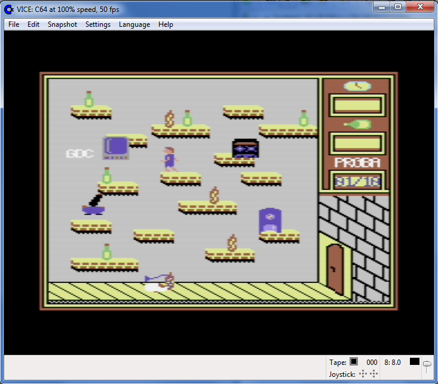

# RIVIERA STORY

### VERSION 0.3 NOTES:
- added jump down from platform (joystick down + fire)
- added timer counter handling
- added beer counter handling
- added bottles and fire animation
- added beer level refilling (joystick up facing bottle)

### VERSION 0.2 NOTES:
- added sprites and sprite movement logic and paths
- added and fixed some graphics elements

A very small game for Commodore 64

Based on the true story...

The year is 199X. Location is unknown, but some "good informed" people said, that it might be Warsaw, "Riviera" students house. Young student (let's call him Fred) was returning from party in club called Hades. It was almost dawn and level of beer running in our hero's veins was dramaticly low. In times like this only bad things can happen...
In a blink of the eye terrible Monstrum (not Monster - he is another person) ascended from mist.
"BEHOLD, MORTAL!! I AM THE MIGHTY KAC MORALNIAK!! I SAW WHAT YOU HAVE DONE WITH ALL MONEY SAVED FOR FOOD!! YOUR PUNISHMENT IS COMMING"

And KAC MORALNIAK grabbed our hero and transported him to torment halls. Can you help him to survive 10 deadly trials??

Sorry but you cant, the game is not finished yet. But it will be..
In release 0.3 you can visit one of the levels. Using Joystick in port 2 you can move left and right. Press fire to jump. Press down+fire to descend from platform. Press up (facing beer bottle) to refill beer. Its only preview.

The finished game will have basic rules:
- survive 2:00 in every of 10 torment chambers. Everything that moves kills you. And red flames are also not good for your health
- you must mantain beer level above 0%. If it is low, it is nessesery to drink from green bottles
- every level enemy speed increases

Coding of this game started on my COVID quarantine, when I was really bored.

# Assembly instructions:

To generate program file use Kickassembler: http://www.theweb.dk/KickAssembler/Main.html#frontpage

java –jar kickass.jar riviera_0_3.asm

All bin files must be in current directory!

# Used tools:

 - Kickassembler
 - Visual Studio Code with Kick Assembler 8-Bit Retro Studio extension by Paul Hocker
 - Spritepad PRO
 - Charpad PRO

